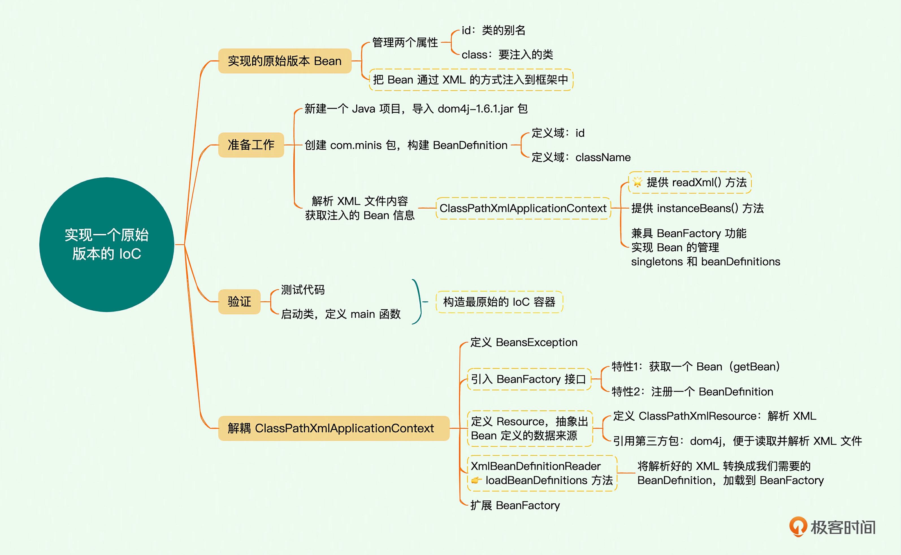
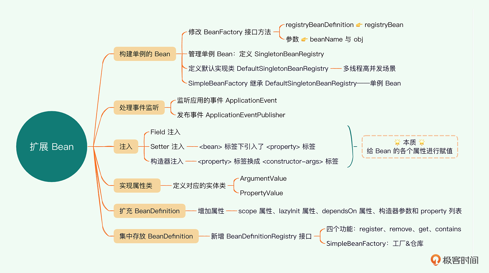
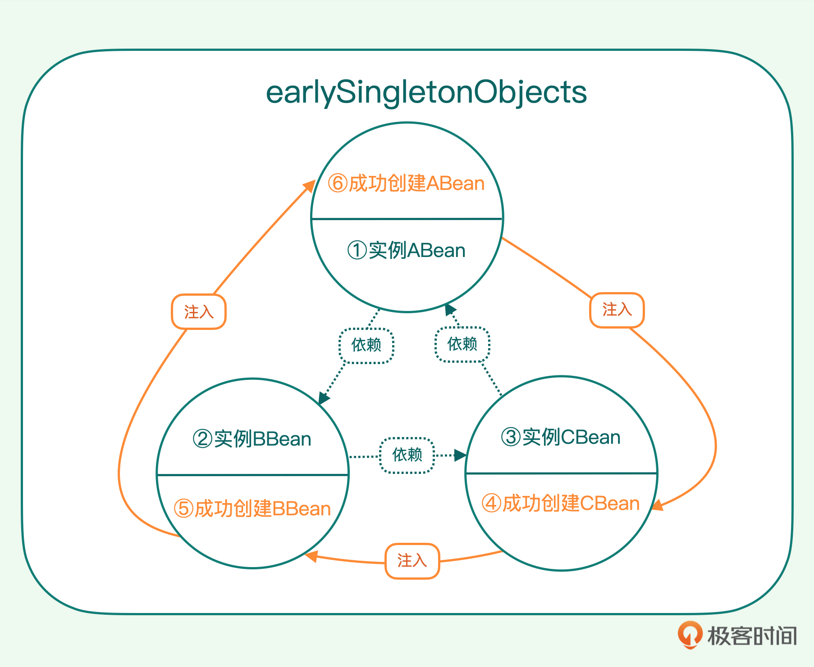
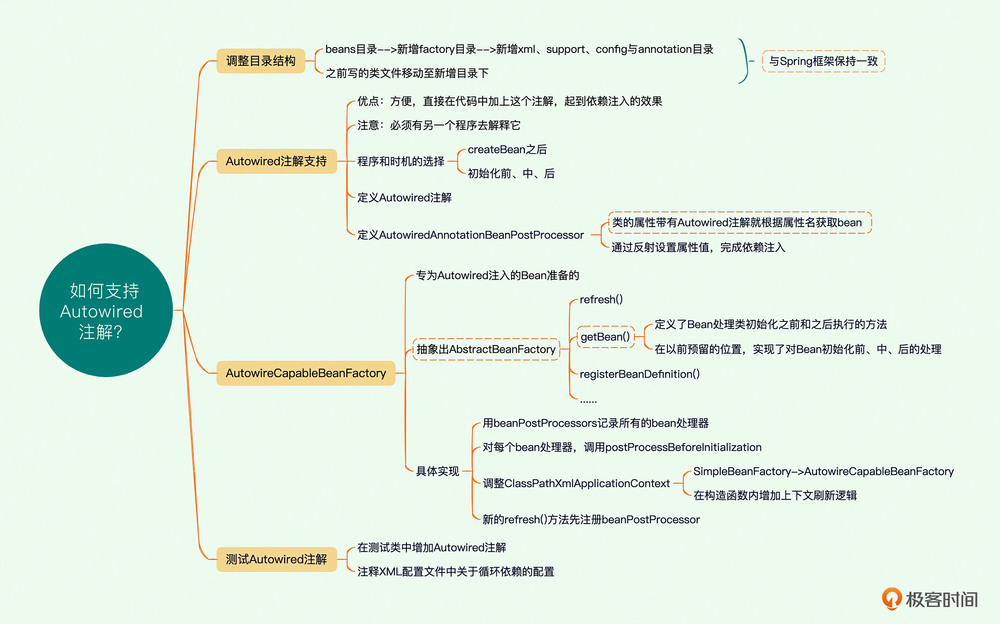
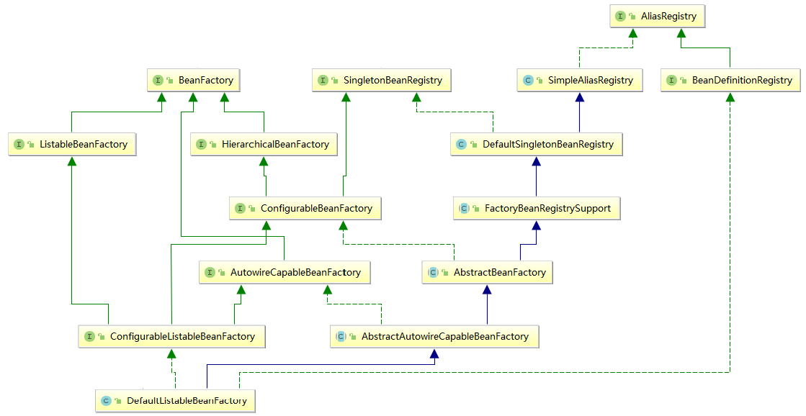
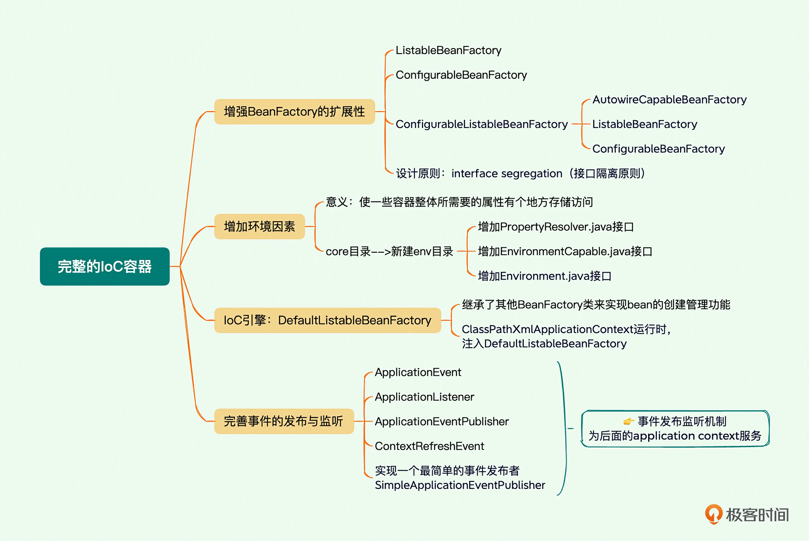
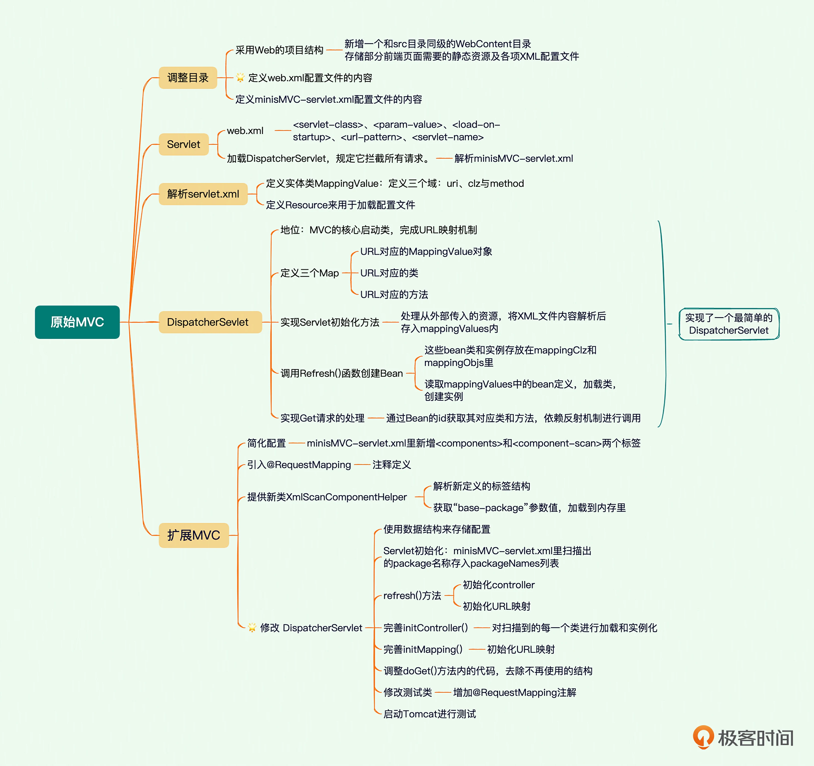

# 实现Spring IoC
## 原始IoC
最初版本，理解IoC容器的基本逻辑

## 扩展Bean
增加单例Bean、事件监听、完善BeanDefinition的属性，加了需要的属性，修改了与之相关的类

## 依赖注入
依次解析构造器参数/属性参数，createBean的时候通过反射赋值，通过ref解决依赖问题  
解决循环依赖问题（主要原因是创建bean的时候其实是先有的bean再注入属性，那就可以把一个早期没有属性的毛坯bean先存起来供注入的时候使用）：

第一步，先实例化 ABean，此时它是早期的不完整毛胚实例，好多属性还没被赋值，将实例放置到 earlySingletonObjects 中备用。然后给 ABean 注入属性，这个时候发现它还要依赖 BBean。  
第二步，实例化 BBean，它也是早期的不完整毛胚实例，我们也将实例放到 earlySingletonObjects 中备用。然后再给 BBean 注入属性，又发现它依赖 CBean。  
第三步，实例化 CBean，此时它仍然是早期的不完整的实例，同样将实例放置到 earlySingletonObjects 中备用，然后再给 CBean 属性赋值，这个时候又发现它反过来还要依赖 ABean。  
第四步，我们从 earlySingletonObjects 结构中找到 ABean 的早期毛胚实例，取出来给 CBean 注入属性，这意味着这时 CBean 所用的 ABean 实例是那个早期的毛胚实例。这样就先创建好了 CBean。  
第五步，程序控制流回到第二步，完成 BBean 的属性注入。  
第六步，程序控制流回到第一步，完成 ABean 的属性注入。至此，所有的 Bean 就都创建完了。  
  
## 增加注解

## 完整的IoC容器
整体的类继承图

# Spring MVC

首先，利用 Servlet 机制，用一个单一的 Servlet 拦截所有请求，由它来分派任务，实现了原始的 MVC 结构。  
然后，把 MVC 和 IoC 结合在一起，在 Servlet 容器启动的时候，给上下文环境里注入 IoC 容器，使得在 Servlet 里可以访问到 IoC 容器里的 Bean。  
之后，进一步解耦 MVC 结构，独立出请求处理器，还用一个简洁统一的注解方式，把 Web 请求方便地定位到后台处理的类和方法里，实现 Spring 的 RequestHandler。  
在前后台打通的时候，实现数据参数的自动转换，也就是说先把 Web 请求的传入参数，自动地从文本转换成对象，实现数据绑定功能。对于返回数据，也自动根据用户需求进行格式化转换，这样实现了 Spring 里面的 data binder 和 data conversion。最后回到前端 View，如果有前端引擎，在 Spring 中引用，把数据自动渲染到前端。

# Spring AOP
## 动态代理：运行时插入逻辑
把代理配置在 XML 文件里，但如果按照原有的 Bean 的定义，这个配置在外部文件里的代理 Bean 本身不能代理业务类，真正需要的是通过这个代理 Bean 来创建一个动态代理，于是引入了 FactoryBean 的概念，不是直接获取这个 Bean 本身，而是通过里面的 getObject() 获取到 Factory Bean 里面包含的对象。  
这样将 IoC 容器里的 Bean 分成了两类：一是普通的 Bean，二是 Factory Bean。在 getObject() 的实现中，使用 JDK 的动态代理技术创建了一个代理。这样就实现了 AOP。  
Spring除了JDK动态代理，还支持cglib动态代理，但实际工程中用的更多是AspectJ动态代理。  
## 拦截器：在方法前后进行拦截
将动态添加的逻辑设计得更加结构化一点，而不是全部简单地堆在 invoke() 一个方法中。为此，提出了 Advice 的概念，表示这是一个增强操作。然后提出 Interceptor 拦截器的概念，它实现了真正的增强逻辑并包装了目标方法的调用，应用程序中实际使用的就是这个 Interceptor。实际实现的是 MethodInterceptor，它表示的是调用方法上的拦截器。  
大部分拦截的行为都是比较固定的，或者在方法调用之前，或者在之后，为了方便处理这些常见的场景，进一步分离出了 beforeAdvice 和 afterAdvice。通过这些工作，只要简单地实现 MethodBeforeAdvice 和 AfterReturningAdvice 即可。整个软件结构化很好，完全解耦。
## Pointcut：批量匹配代理方法
使用一个特殊的 Advisor，这个 Advisor 接收一个模式串，而这个模式串也是可以由用户配置在外部文件中的，然后提供 isMatch() 方法，支持按照名称进行模式匹配。具体的字符串匹配工作，采用从前到后的扫描技术，分节段进行校验。  
概念梳理：
* Join Point：连接点，连接点的含义是指明切面可以插入的地方，这个点可以在函数调用时，或者正常流程中某一行等位置，加入切面的处理逻辑，来实现代码增强的效果。
* Advice：通知，表示在特定的连接点采取的操作。
* Advisor：通知者，它实现了 Advice。
* Interceptor：拦截器，作用是拦截流程，方便处理。
* Pointcut：切点
## AutoProxyCreator：自动添加动态代理(批量匹配代理对象)
利用 Bean 的时序，使用一个 BeanPostProcessor 进行后期处理。这个 Processor 接收一个模式串，而这个模式也是可以由用户配置在外部文件里的，然后提供 isMatch() 方法，支持根据名称进行模式匹配。匹配上之后，还是利用以前的 ProxyFactoryBean 创建动态代理。系统会自动把业务 Bean 改头换面，让它变成一个 Factory Bean，里面包含的是业务 Bean 的动态代理。

